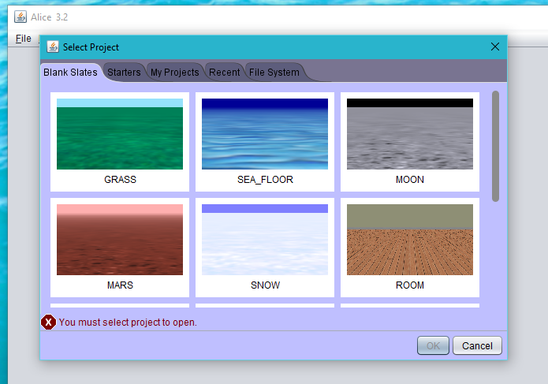
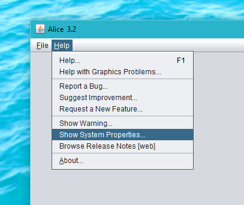
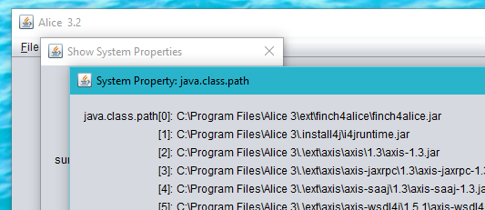
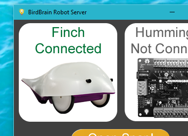

# Finch 4 Alice

Ever wanted to control your [Finch robot](http://www.finchrobot.com/) from within [Alice 3](http://www.alice.org/)?  Well, now you can!

Finch 4 Alice provides a simple extension to Alice 3 that adds methods for controlling a Finch robot to all Transport subclass instances.

## Building

You can build the Jar only for manual installation, build and install directly, or create an interactive multi-platform installer.

### Prerequisites

#### Alice 3

You must have an installation of [Alice 3](http://www.alice.org/) on the build machine, preferrably installed in the default location.  This location varies by platform, as shown in the following table:

| Platform | Default Installation Location |
| -------- | ----------------------------- |
| Windows  | C:\Program Files\Alice 3      |
| Linux    | ~/Alice3/lib                  |
| Max OS X | ~/Alice3/lib                  |

Finch 4 Alice has been tested against Alice version 3.2.5.0.0.  Previous versions used a different type of installer and are not compatible.

To download a copy of Alice for your environment, visit the [Alice website](http://www.alice.org/).

#### JDK

You must have the Java Development Kit (JDK) version 1.7 or newer installed and properly configured.  You can obtain a copy of the JDK [from Oracle](http://www.oracle.com/technetwork/java/javase/downloads/index.html), or from a distribution provided by your operating system vendor.  OpenJDK should work fine, if you don't feel like using the Oracle proprietary JDK.

### Building the Jar file only

If Alice 3 is installed in the default location, executing the following command from within the project folder will build the Jar file.

```
./gradlew jar
```

If Alice is installed in a non-standard path, you can specify the correct path by providing it via the `aliceDir` command-line property value as follows:

```
./gradlew jar -PaliceDir=/path/to/alice3
```

### Installation

#### Direct install

If you wish to install Finch 4 Alice on the build machine, it can be installed directly by Gradle.  To accomplish this, execute the following command:

```
./gradlew install
```

This will automatically perform the steps described under [Manual installation](manual-installation).

Because Alice is installed system-wide by default on Windows, you will need to ensure you started the command window as Administrator or the installation will likely fail due to lack of permissions.

Under Linux, you should be able to run the install as a normal user, as long as Alice is installed in the default location under that user's home directory.  If it is installed in a system-wide location like `/bin`, `/usr/bin`, or `/usr/local/bin` you will need to run the command as root with `sudo`.

#### Multi-platform installer

This installer is the easiest to use for most end-users.  It provides an intuitive window-based installer that walks users through the installation process, doesn't require any special build tools, and will run on all of the supported platforms with a properly configured JRE.

```
./gradlew izPackCreateInstaller
```

Once generated, you can find the installer under `build/distributions/finch4alice-<version>-installer.jar`.

#### Manual installation

If for some reason the above options don't work for your particular situation, or you simply enjoy getting into the nitty gritty aspects of software hacking, then this is the section for you.

To manually install Finch 4 Alice:

* First build the Jar as described above under [Building the Jar file only](#building-the-jar-file-only).
```
./gradlew jar
```

* Create a new subdirectory under the Alice `ext` directory named `ext/finch4alice`.
```
mkdir /path/to/alice/ext/finch4alice
```

* Copy the generated Jar file `build/distributions/finch4alice-<version>.jar` into the Alice `ext/finch4alice` directory, and rename it to `finch4alice.jar`.
```
cp ./build/finch4alice-0.1.jar /path/to/alice/ext/finch4alice/finch4alice.jar
```

* Create an Install4J vmoptions configuration file to instruct Alice to load the new Jar when it starts up.
  * For Windows, copy the file `src/resources/Alice 3.vmoptions.windows` into the Alice main folder and rename it to `Alice 3.vmoptions`.
  * For Linux and Mac OS X, copy `src/resources/Alice 3.vmoptions.linux`:
```
cp "src/resources/Alice 3.vmoptions.linux" "/path/to/alice/Alice 3.vmoptions"
```

Because Alice is installed system-wide by default on Windows, you will likely need to confirm a few UAC dialogs to copy and rename the files.

Under Linux, you should be able to run the install as a normal user, as long as Alice is installed in the default location under that user's home directory.  If it is installed in a system-wide location like `/bin`, `/usr/bin`, or `/usr/local/bin` you will need to run the command as root with `sudo`.

## Using Finch 4 Alice

### Confirming installation

To ensure that everything is installed and configured properly:

* Launch Alice

* When prompted to load a project, simple close the dialog by clicking 'Cancel'.



* Select the `Help -> Show System Properties` menu



* Click `Show...` to the right of `java.class.path`


* Verify that the finch4alice jar is listed at the beginning of the class path.



### Connecting to a Finch

Now that you have Finch 4 Alice installed, what can you do with it?  In this section, we'll go through a simple example and "kick the tires", so to speak.

#### Prerequisites

* You need an installation of Alice 3, with Finch 4 Alice installed.

* You need a Finch robot, properly connected to your computer.  If you don't happen to have a Finch, they can be purchased from the [Finch Robot website](http://www.finchrobot.com/).

* You will need to install the BirdBrain Robot Server.  You can find installers for various operating systems in the [BirdBrain Robot Server GitHub repository](https://github.com/BirdBrainTechnologies/BirdBrainRobotServer/tree/master/Packages).  Perhaps surprisingly, Finch 4 Alice doesn't actually communicate directly with a Finch robot.  It relies on the BirdBrain Robot Server to do that.  This simplifies the implementation and reduces the number of dependencies that would need to be patched into Alice.

#### Example project

- Start the BirdBrain Robot Server and connect your Finch robot.  The BirdBrain server window should look as follows when it detects a connected Finch:



- Launch Alice and when prompted to select a project, create a new project based on the 'GRASS' theme.


- Click `Setup Scene`

- Click `Transport classes`

- Click `Watercraft classes`

- Click `new FishingBoat()`

- Click `Edit Code`

- Drag the `finchSetLED` procedure from the pane on the left into the code window for 'myFirstMethod'
- Select `Custom Whole Number...`, then `0` for the second parameter and `0` for the third parameter.
- Enter `255` when prompted for the custom value for the first parameter.

- Drag the `delay` procedure into 'myFirstMethod'
- Select `2.0` for the number of seconds to delay

- Drag the `finchSetLED` procedure into 'myFirstMethod'
- Select `0` for all three parameters.

- Drag the `say` procedure into 'myFirstMethod'
- Select `Custom TextString...` and enter `All done` when prompted.

- You are now ready to try running your test project.  Click the `Run` button and you should see the LED in the nose of your Finch turn red for two seconds, then turn off.

> More example projects can be found in the `examples` subfolder.

## How it works

Alice 3 doesn't directly provide an extension mechanism for adding additional functionality such as access to external libraries or jars from within the Alice editor itself.

To work around this, Finch 4 Alice causes the Java runtime to load a custom Jar file into the class path before the other Alice classes are loaded.  Due to the way that the Java class loader works, classes found earlier in the class path will override classes of the same name that are found later (that is, a first-come-first-served policy).

The Jar generated by Finch 4 Alice contains a replacement version of the `org.lgna.story.STransport` class within Alice which all "transport" objects (for example Automobile or Boat) are subclasses of.  Not counting inheritied methods or properties, the implementation of that class within Alice itself is pretty minimal, consisting of a constructor and a single property.  That simplicity made it an ideal target for adding additional methods to.

One may wonder "Why not add a new type of object with Alice to represent a Finch?"  In one word: Complexity.  Due to how the Alice code is currently structured, adding an additional object type that could be selected from within the UI would have had far-reaching implications in terms of the number of classes that would need to be patched.  In the interests of promoting [Occam's razor](https://en.wikipedia.org/wiki/Occam's_razor) and the princible of simplicity, we chose to take a simpler route.  Specifically, it was easier to reason about what was needed to accomplish the task and get on with playing around with a Finch from within Alice :)

### Additions to the STransport API

Finch 4 Alice works by extending the STransport parent class within Alice.  Several new procedures and functions are added that expose the full range of functionality provided by the Finch robot.

The new procedures and functions are listed below.  If you want the full details, be sure to check out [the Javadoc API](https://bradcfisher.github.io/finch4alice/api/0.1/).

#### Finch procedures

`finchBuzz(int frequency, int duration)`

`finchPlayRTTTL(String rtttl, double frequencyMultiplier, double durationMultiplier, boolean useComputerSpeakers)`

`finchSetLED(int red, int green, int blue)`

`finchSetWheelVelocities(int leftVelocity, int rightVelocity)`

`finchStopWheels()`

#### Finch functions

`int[] finchGetLightSensors()`

`int finchGetLeftLightSensor()`

`int finchGetRightLightSensor()`

`boolean finchIsLeftLightSensor(int limit)`

`boolean finchIsRightLightSensor(int limit)`

`double finchGetXAcceleration()`

`double finchGetYAcceleration()`

`double finchGetZAcceleration()`

`boolean finchIsBeakDown()`

`boolean finchIsBeakUp()`

`boolean finchIsLevel()`

`boolean finchIsUpsideDown()`

`boolean finchIsLeftWingDown()`

`boolean finchIsRightWingDown()`

## Troubleshooting FAQ

*Symptom*: Alice raises an exception when one of the example projects is loaded.

*Cause*: This is most likely caused by trying to load a project into an installation of Alice that has not yet had Finch 4 Alice installed.  The example projects contain references to the new methods added by Finch 4 Alice, and exceptions are raised when those instructions are processed without the Finch 4 Alice code loaded.

---

## Debugging and Logging


TODO: Add some details on debugging and logging here


## Contributing

Contributions are very welcome and are accepted through pull requests.  Simply create a [fork on GitHub](https://help.github.com/articles/fork-a-repo/), commit and push your updates to your fork, and then [submit a pull request](https://help.github.com/articles/using-pull-requests/) for review.

## Bugs and Features Requests

Please submit all bug reports and feature requests to the project [issue tracker](../../issues/).

## Disclaimers & License

The Finch 4 Alice project is not affiliated with either the Finch or Alice 3 projects or their respective intellectual property holders.

The Finch robot is produced by [BirdBrain Technologies LLC](http://www.birdbraintechnologies.com/).

Alice 3 is developed by [Carnegie Mellon University](http://www.cs.cmu.edu/).

This software interacts with the [BirdBrain Robot Server](https://github.com/BirdBrainTechnologies/BirdBrainRobotServer) which is covered by a [Creative Commons Attribution-ShareAlike 3.0 Unported License](http://creativecommons.org/licenses/by-sa/3.0/).

---

Finch 4 Alice is released under the BSD 2-Clause License

Copyright (c) 2015, Brad Fisher  
All rights reserved.

Redistribution and use in source and binary forms, with or without modification, are permitted provided that the following conditions are met:

1. Redistributions of source code must retain the above copyright notice, this list of conditions and the following disclaimer.

2. Redistributions in binary form must reproduce the above copyright notice, this list of conditions and the following disclaimer in the documentation and/or other materials provided with the distribution.

THIS SOFTWARE IS PROVIDED BY THE COPYRIGHT HOLDERS AND CONTRIBUTORS "AS IS" AND ANY EXPRESS OR IMPLIED WARRANTIES, INCLUDING, BUT NOT LIMITED TO, THE IMPLIED WARRANTIES OF MERCHANTABILITY AND FITNESS FOR A PARTICULAR PURPOSE ARE DISCLAIMED. IN NO EVENT SHALL THE COPYRIGHT HOLDER OR CONTRIBUTORS BE LIABLE FOR ANY DIRECT, INDIRECT, INCIDENTAL, SPECIAL, EXEMPLARY, OR CONSEQUENTIAL DAMAGES (INCLUDING, BUT NOT LIMITED TO, PROCUREMENT OF SUBSTITUTE GOODS OR SERVICES; LOSS OF USE, DATA, OR PROFITS; OR BUSINESS INTERRUPTION) HOWEVER CAUSED AND ON ANY THEORY OF LIABILITY, WHETHER IN CONTRACT, STRICT LIABILITY, OR TORT (INCLUDING NEGLIGENCE OR OTHERWISE) ARISING IN ANY WAY OUT OF THE USE OF THIS SOFTWARE, EVEN IF ADVISED OF THE POSSIBILITY OF SUCH DAMAGE.