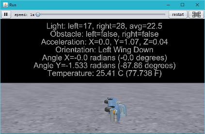
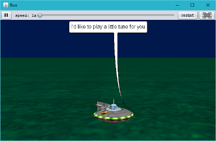
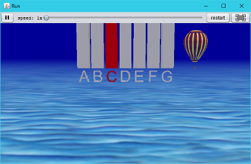
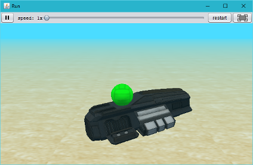
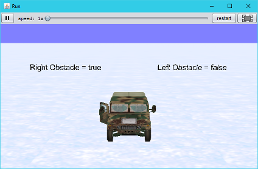

# Interactive Examples

This directory contains several example projects you can load into Alice after Finch 4 Alice is
installed to demonstrate communication with a Finch robot.

  - [All Sensors / Accelerometer](#all-sensors--accelerometer)
  - [Buzzer](#buzzer)
  - [LED](#led)
  - [Light Sensors](#light-sensors)
  - [Obstacle Sensors](#obstacle-sensors)
  - [Temperature Sensor](#temperature-sensor)
  - [Wheel Velocities](#wheel-velocities)

## All Sensors / Accelerometer

If you want to dive right in and see a demonstration of all of the Finch's onboard sensors in one
example application, check out the [template.a3p](template.a3p?raw=true) project.  This project
continuously displays the readings from the Finch's sensors, as well as demonstrating use of the
Finch to act as a controller by using the accelerometer orientation to manipulate an on-screen
object.

## Buzzer

If you fancy a little classical music, check out the [playRtttl.a3p](playRtttl.a3p?raw=true)
project, which demonstrates the Finch buzzer and plays a classic tune.  The project utilizes the
high-level finchPlayRTTTL function provided by Finch 4 Alice to play an RTTTL ringtone.

If you prefer lower-level access to the Finch's buzzer, check out the [piano.a3p](piano.a3p?raw=true) project.  By utilizing the `finchBuzz()` method, the Finch is turned into a musical instrument.

## LED

In the [setLed.a3p](setLed.a3p?raw=true) project, the Finch masquerades as a spaceship which
demonstrates displaying various intensities of the primary colors with the Finch full-color LED
while an on-screen ball mimics the color change.

## Light Sensors

The [lightSensors.a3p](lightSensors.a3p?raw=true) project illustrates reading the two light sensors.
A submarine has been used to represent the Finch in this project, and the intensity readings from
the two light sensors are displayed both numerically and visually.

The accelerometer is also utilized as a control mechanism, allowing the user to stop the program by
flipping the Finch over.

## Obstacle Sensors

If you're looking to exercise the Finch's obstacle sensing capabilities, try out the [obstacleSensors.a3p](obstacleSensors.a3p?raw=true) project.  A rugged Humvee braves the icy wilderness to demonstrate what happens when a Finch encounters objects in its path.

## Temperature Sensor

Check out [temperatureSensor.a3p](temperatureSensor.a3p?raw=true) for a demonstration of the Finch's
temperature sensor.  Temperature readouts are displayed in both Fahrenheidt and Celcius.

The light sensors are also demonstrated as a means to stop the program by covering the Finch's
light sensors.

## Wheel Velocities

The Finch goes mobile with [wheelVelocities.a3p](wheelVelocities.a3p?raw=true), a project that
demonstrates moving the Finch by controlling the speed of the wheels.

